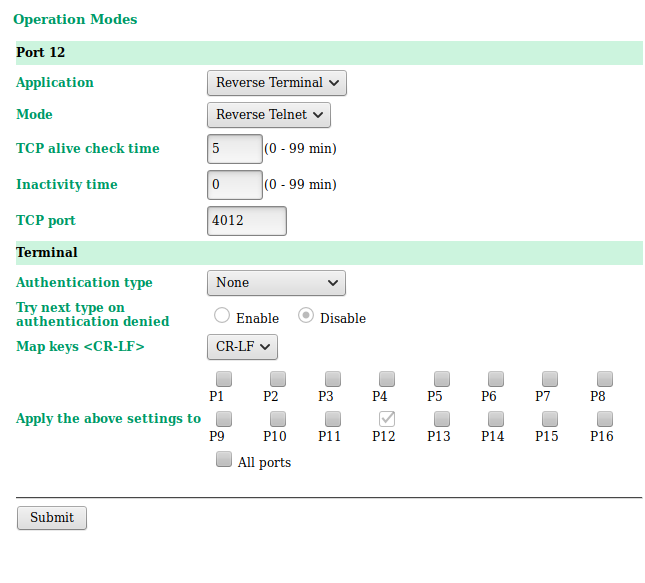
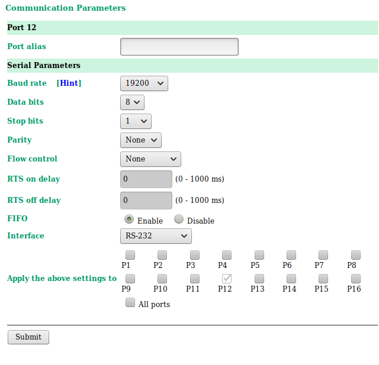

ESS MTCA NAT MCH Configuration
======

**This module is under development.**

MCH Configuration is one of teadious and combersome procedures. This repository
may help users to configure their NAT MCH with minimum efforts. With tftp, 
expect, and shell scripts, ICS at ESS would like to develop an automation tool
to configure the NAT MCH massively. 

Currently, we are in the stage to find the optimal solution and the standard
configuration options of MCH per a ESS Standard 3U and 9U MTCA System 
Configuration. This repository can hold almost all resouces for NAT MCH
configuration. 

## Requirements

* A TFTP Server 
* Expect 
* Configuration of TFTP according to the directory structure, shown in `Current TFTP Server Configuration at ESS`
* MOXA Serial Server NPort 6650-16
* In-house Serial Cable between MCH and MOXA (One has to understand MOXA pinout and NAT MCH pinout properly. Note that one can find few discrepencies among NAT MCH manuals. )

### Expect
We use the expect to configure the MCH within four steps. Please look at
[How to use expect commands](expect/README.md). Expect scripts already know the following the TFTP directory structure and its corresponding files as well.

### Current TFTP Server Configuration at ESS

```
$ cd tftp_path
$ tree -L 3
.
├── conf
│   ├──  nat_mch_fw2.20.4_3u_cfg.txt -> /home/iocuser/ics_gitsrc/mch_config/src/nat_mch_fw2.20.4_3u_cfg.txt
│   └──  nat_mch_fw2.20.4_9u_cfg.txt -> /home/iocuser/ics_gitsrc/mch_config/src/nat_mch_fw2.20.4_9u_cfg.txt
├── fw
│   └── 2.20.4
│       └──  mch_fw_2_20_4.bin
├── latest_mch_conf_3u_cfg.txt -> conf/nat_mch_fw2.20.4_3u_cfg.txt
├── latest_mch_conf_9u_cfg.txt -> conf/nat_mch_fw2.20.4_9u_cfg.txt
└── latest_mch_fw.bin -> fw/2.20.4/mch_fw_2_20_4.bin
```

### MOXA NPort 6650-16 Configuration


||
| :---: |
|**Figure 1** The screenshot for MOXA NPORT Configuration : Operation Modes. |


||
| :---: |
|**Figure 2** The screenshot for MOXA NPORT Configuration : Communication Paremeters. |

